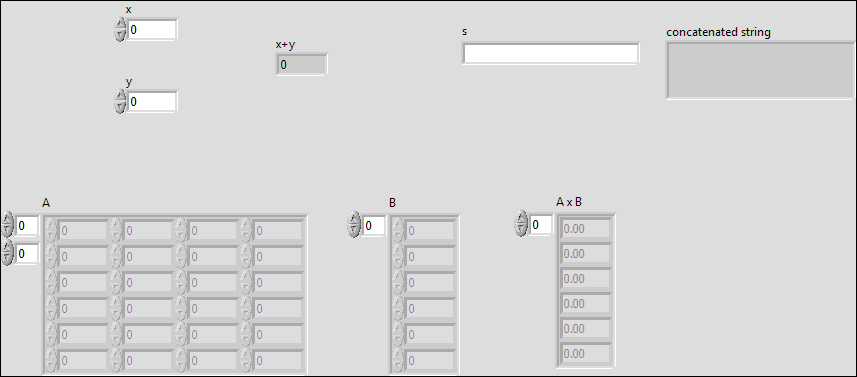
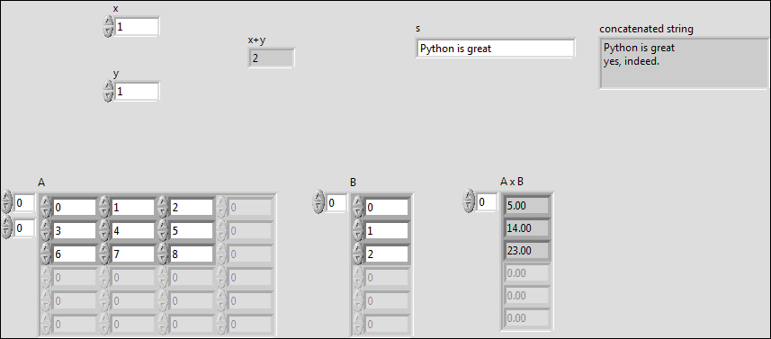

# Running experiments from Python: LabView wrapper

There are many existing instrument drivers written in the LabView graphical programming language. To take advantage of this (from a Python programmer's point of view), the simple wrapper here allows setting up, running, and retrieving the outputs of LabView vis from Python code running on a Windows computer.

## Example usage:

### steps:
- Find the vi's absolute path.
- Construct a dictionary with the required inputs.
- Put together a list with the names of the desired outputs (can pick as many or as few as needed).
- Provide the above information to lv_wrapper.runvi().

The output is a dictionary in which the item names correspond to the output_names list and the item values are python objects.


```python
import lv_wrapper
import numpy as np
import os

vi_path = os.path.abspath("example.vi")
inputs = {
    'x': 1,
    'y': 1,
    's': "Python is great",
    'A': np.arange(9).reshape((3, 3)),
    'B': np.arange(3),
}
output_names = ['x+y', 'concatenated string', 'A x B']

# run the vi passing the inputs and a list of
# desired output names
results_dictionary = lv_wrapper.runvi(
    vi_path = vi_path,
    inputs = inputs,
    output_names = output_names,
    wait_for_completion = True,
)

# use the vi outputs:
for name, value in results_dictionary.items():
    print "{}:".format(name)
    print value
    print
```

    x+y:
    2.0
    
    A x B:
    (5.0, 14.0, 23.0)
    
    concatenated string:
    Python is great
    yes, indeed.
    


## example.vi front panel before running



## example.vi after running


